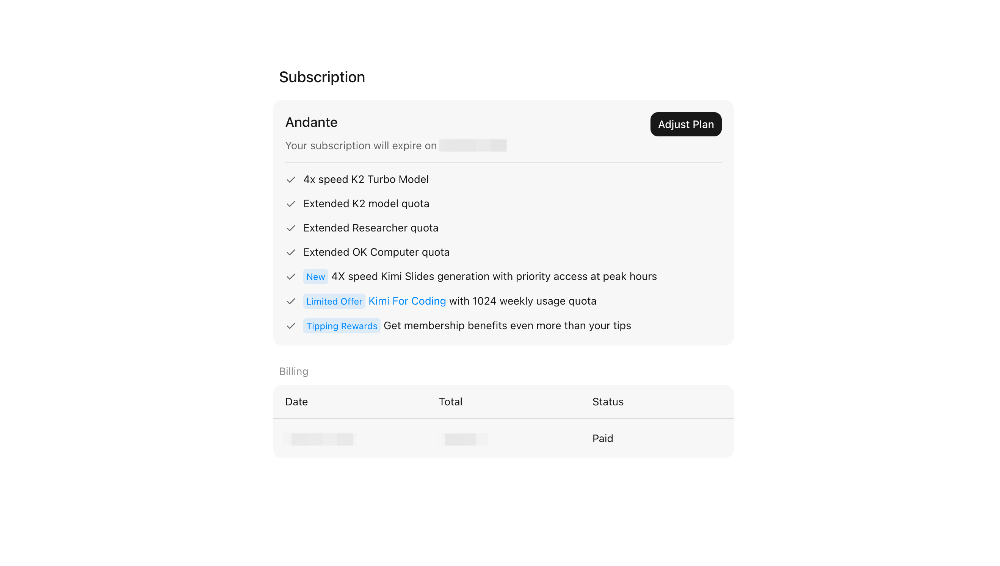
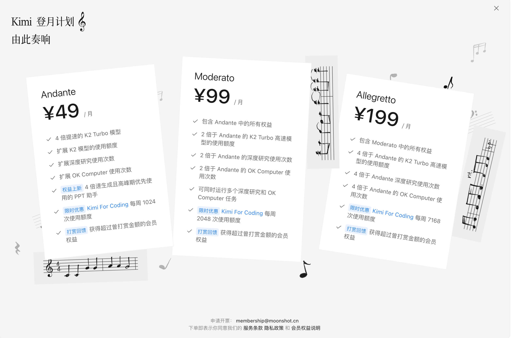
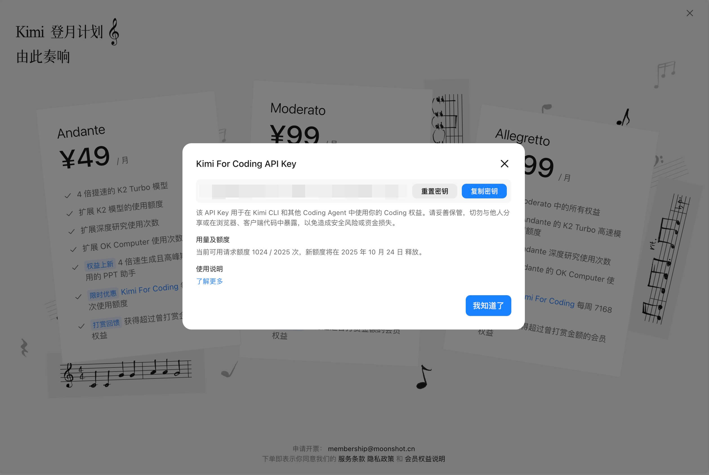

# Kimi For Coding Membership Benefits

**Kimi For Coding** is a premium membership feature under the Kimi Membership Plan, providing individual developers with enhanced AI support for personal software development.

- **Multi-Scenario Compatibility**: Designed to work with Kimi CLI and other commonly used code assistants for smoother workflow integration.
- **Enhanced Performance**: Supports high-frequency coding interactions, with dynamically managed request limits and output speeds depending on system capacity.

*Actual performance and interoperability may vary. Kimi For Coding is subject to the Membership Terms and may be adjusted or updated periodically.*

> New Users: Please visit [kimi.com](https://www.kimi.com/), sign in, click the avatar in the lower-left corner, and navigate to “Membership Plan” to subscribe.

> Existing Members: Obtain the API key and check requests quota on the Kimi For Coding pop-up of membership page.

## Developer quickstart

### 1. Obtain your Kimi For Coding API Key

#### Optiona A - Subscription Management Console

Click Avatar in the lower-left corner → Settings → Manage → Subscription

Click the “Kimi For Coding” text to trigger the pop-up; copy and securely store the key.

#### Option B - Membership Details Page

Membership Details page → Click the “Kimi For Coding” link to trigger the pop-up.

Copy or reset the API Key, or check requests quota on the pop-up.

### 2. Configure the Key in Supported Development Tools

* [Kimi CLI integration](./kimi-cli.html)
* [Claude Code / Roo Code integration](./third-party-agents.html)

