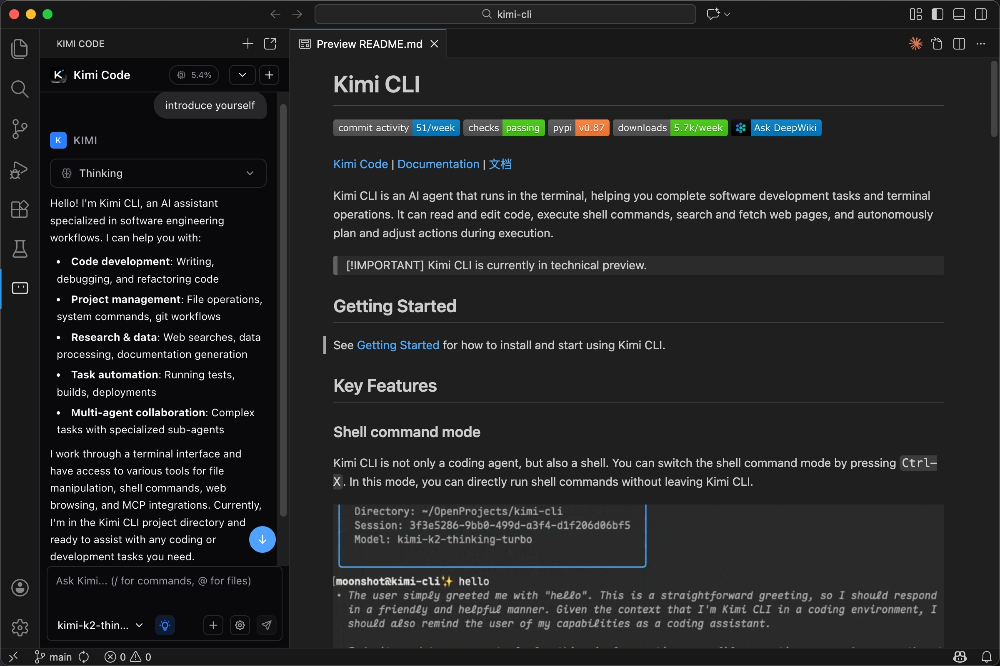
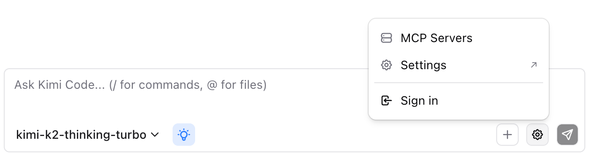
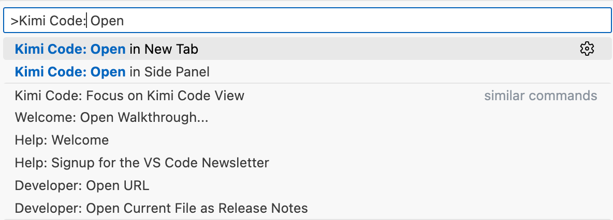

# Kimi Code for VS Code

Kimi Code lives inside VS Code so you can ask questions, review diffs, and ship changes with beautiful UI. It reads files you reference, proposes edits as diffs, and runs tools with your approval. You stay in control while moving quickly.

Kimi Code is a VS Code extension with a native chat panel. It supports file and folder references with @-mentions, slash commands for project scanning and context control, file change tracking with diff view and revert, and MCP server integration for external tools. The panel can live in the Activity Bar, side panel, or a separate tab.

## Requirements

A Kimi account subscription or a Kimi API key.

## Install

Install from the [VS Code Marketplace](vscode:extension/moonshot-ai.kimi-code). 

If the extension does not appear, restart VS Code or run "Developer: Reload Window" from the Command Palette. (Mac: Cmd+Shift+P, Windows/Linux: Ctrl+Shift+P).

## Authentication

Kimi Code supports two modes:

**Kimi Account**: Click Sign in on the login screen. A browser window opens for authorization. Complete the flow and return to VS Code.

**API Key**: If you already configured a API key, click Skip. The extension works without login.

You can switch modes anytime from the gear icon. Sign out returns you to the login screen.

## Basic Usage

### Open the Panel

Click the Kimi icon in the Activity Bar, or open from Command Palette with "Kimi Code".

### Reference Files

Type `@` followed by a file or folder name. For example, `@src/handlers/` references a folder, `@app.ts` references a file, and `@src/app.ts:10-20` references specific lines. 

Press `Alt+K` to insert the current file or selected code as a reference.

### Slash Commands

Type `/` to open the command menu. Use `/init` to scan the project and generate documentation, or `/compact` to compress context when it gets long.

### Send Media Input

Paste, drag, or select media files to include them in your message. Supported formats include PNG, JPEG, GIF, WebP, HEIC for images, and MP4, WebM, MOV for video. You can attach up to 9 files per message, with images limited to 5MB each, videos to 40MB each, and 80MB total. Models without multimodal support are automatically filtered out when media is attached.

## Models and Thinking Mode

Switch models from the dropdown in the input bar.

Some models support extended reasoning. The thinking toggle has three behaviors: hidden when the model does not support thinking, switchable when the user can enable or disable it per message, or always on for models like k2-thinking. 

When enabled, thinking steps appear collapsed in the response and can be expanded to see the reasoning process.

## Approvals and Tool Execution

When Kimi proposes to run a tool or write a file, it shows an approval dialog with three options:

- **Yes**: Approve this single action
- **Yes, for this session**: Approve all similar actions until you start a new conversation
- **No**: Reject the action

Enable `kimi.yoloMode` in settings to auto-approve all tool calls. Use this when you trust the workflow and want speed.

## File Change Tracking

When Kimi modifies files, changes are tracked and displayed in the File Changes bar. You see a list of modified files with their status (Added, Modified, or Deleted) along with line counts for additions and deletions.

For each file, you can view the diff in VS Code's native diff view, revert to the original state, or keep the change to clear tracking. Batch actions let you keep all or undo all changes at once. The baseline is captured on first modification within a session, and reverting restores to that baseline.

## Conversation History

Click the history dropdown in the header to browse past sessions. Sessions are stored locally and can be searched by keyword. You can delete old sessions or load one to continue where you left off.

The status bar shows context usage percentage along with input and output token counts. Use `/compact` when context gets high.

## MCP Servers

MCP (Model Context Protocol) servers extend Kimi with external tools and services. Open Action Menu > MCP Servers to manage them.

Two transport types are supported: stdio for local command-line tools where you specify command, args, and environment variables, and http for remote services where you specify a URL with optional OAuth.

Recommended servers are available for one-click install, including Playwright for browser automation, Context7 for real-time documentation, and GitHub for API access. Some servers require OAuth authentication. Click Authorize to open the flow, or Reset Auth to clear credentials. Test the connection before saving to verify the server works.

## Commands and Shortcuts

| Shortcut                       | Action                                                           |
| ------------------------------ | ---------------------------------------------------------------- |
| `Ctrl+Shift+K` / `Cmd+Shift+K` | Focus the Kimi input box                                         |
| `Alt+K`                        | Insert current file reference                                    |
| `Ctrl+N` / `Cmd+N`             | New conversation (requires `kimi.enableNewConversationShortcut`) |

Open Command Palette and type "Kimi Code" to access additional commands: Open in New Tab, Open in Side Panel, and New Conversation.

## Settings

Configure under the "Kimi" section in VS Code Settings.

| Setting                              | Default | Description                                       |
| ------------------------------------ | ------- | ------------------------------------------------- |
| `kimi.yoloMode`                      | false   | Auto-approve all tool calls                       |
| `kimi.autosave`                      | true    | Save files before Kimi reads or writes them.      |
| `kimi.executablePath`                | ""      | Custom path to Kimi Code CLI (empty uses bundled) |
| `kimi.enableNewConversationShortcut` | false   | Enable Cmd/Ctrl+N for new conversation            |
| `kimi.useCtrlEnterToSend`            | false   | Send with Ctrl/Cmd+Enter instead of Enter         |
| `kimi.environmentVariables`          | {}      | Environment variables passed to Kimi Code CLI     |

## Troubleshooting

**No workspace open**: Open a folder in VS Code. Kimi Code requires a workspace to function.

**CLI not found**: Install the Kimi Code CLI manually and set `kimi.executablePath`, or ensure the bundled Kimi Code CLI is present.

**Login keeps failing**: Try skipping login and using Kimi API key mode. Check network connectivity. You can retry from Action Menu later.

**Nothing happens when sending**: Verify that the Kimi Code CLI is available, a model is configured, and a workspace folder is open. Check "Kimi Code: Show Logs" for errors.

**Connection timeout**: If no response within 30 seconds, the connection times out. Check network, then retry the message.

**Preflight errors**: Some errors prevent sending, such as Kimi Code CLI not found, version too low, not logged in, or session busy. The error appears as a toast and your input is preserved for retry.

## Example Workflows

**Explain Code**: Type `@` and select a file or folder, then ask to explain the flow. Follow up for specifics.

**Refactor**: Reference the target like `@src/feature/`, ask for a refactor plan, review diffs and approve selectively, and use Revert if needed.

**Debug**: Paste the error or stack trace, reference relevant files, ask for diagnosis and fix, then approve the proposed changes.

**Project Overview**: Reference a folder like `@src/services/` and ask for a module map or architecture summary. Follow up about dependencies or weak spots.

## Quick Reference

Type `/` to open the command menu and `@` to reference files or folders. Press `Alt+K` to insert the current file. Use the Action Menu (gear icon) for settings, MCP configuration, and authentication. The File Changes bar shows all modifications with diff and revert options. Toggle thinking mode for extended reasoning, or enable YOLO mode for auto-approval.
