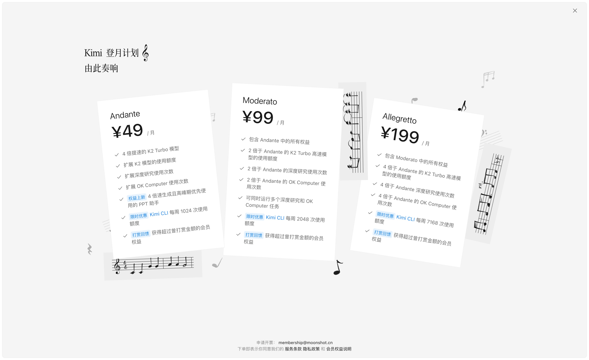
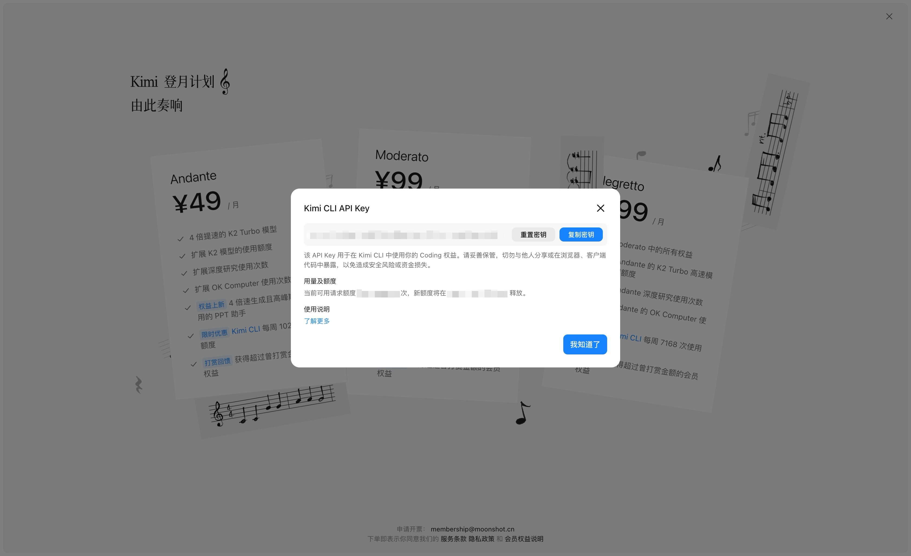
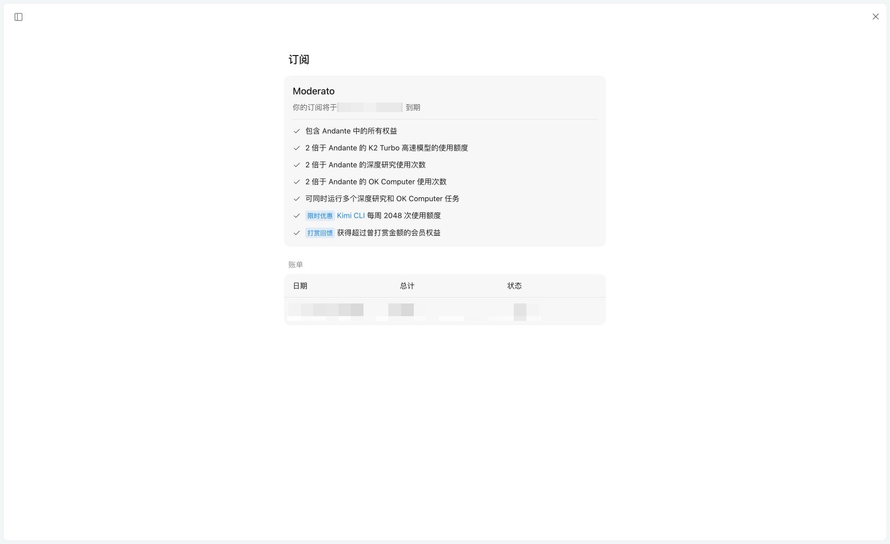

# 欢迎使用

欢迎！这里将介绍 Kimi CLI 与 Coding 权益的相关内容，可以通过左侧的侧边栏快速导航。

## 功能亮点

* 顶尖编码能力：Kimi For Coding 系列模型具备超强代码和 Agent 能力，在多项基准性能测试中超过其他主流开源模型

* 兼容多个场景：兼容 Claude Code、Roo Code，轻松融入各类开发流程

* 更快更稳响应：每 5 小时 100-500 次高速请求

* 限时特惠权益：Kimi CLI 现已加入 Kimi 包月会员权益，最低 ¥49 元即可在获得 Kimi 端上全部会员权益同时，拥有每周至少 1024 次请求额度

***

> 未订阅用户前往 [Kimi](https://www.kimi.com/) 登录后点击左下角用户头像，进入“会员计划”即可订阅体验
>
> 已订阅的用户可在会员页弹窗获取 API Key 并查询使用额度

## API Key 查询指引

> 以下均为示意图，实际权益等展示内容以线上页面为准。

* 方法一：会员详情页查询

  * 在会员详情页上，点击 Kimi CLI 蓝字，唤起弹窗

  

  * 在弹窗中复制或重置 API Key、查看用量及额度

  

* 方法二：在订阅管理页查询

  * 点击左下角用户头像 - 设置 - 管理 - 订阅，进入如下页面

  

  * 点击 Kimi CLI 蓝字，唤起弹窗，在弹窗中复制或重置 API Key、查看用量及额度
