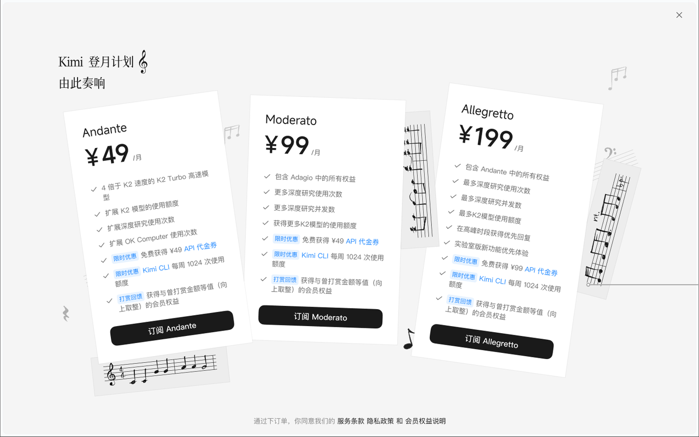
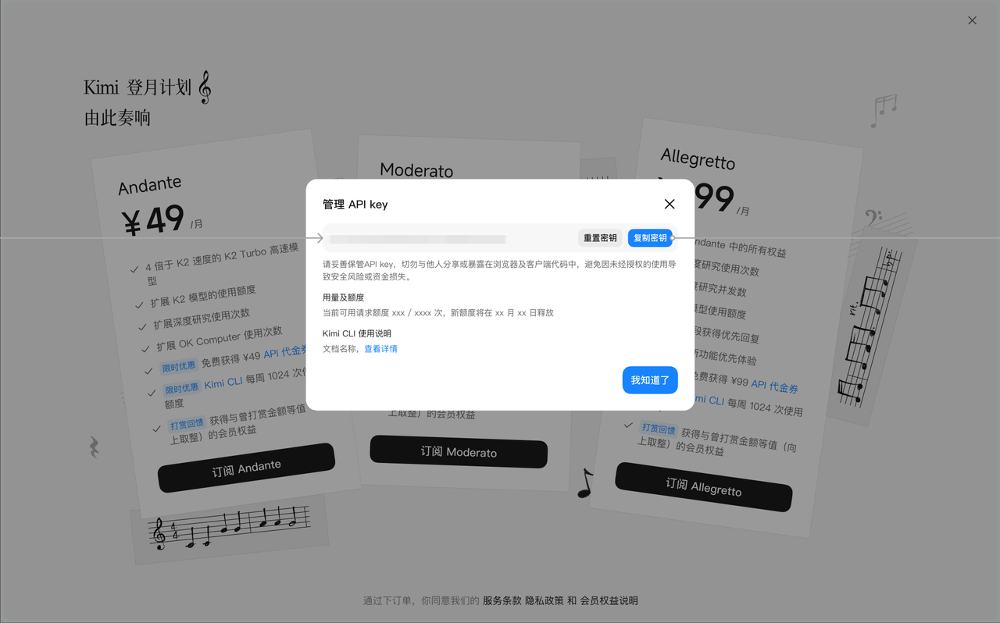
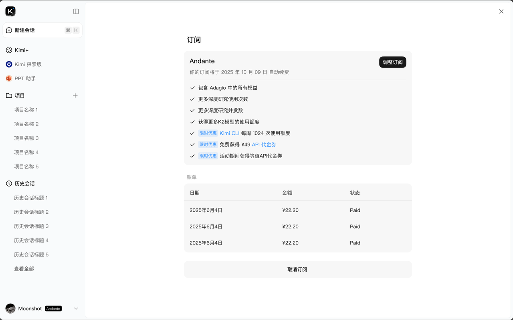

# 欢迎使用

欢迎来到 Kimi Coding Plan 的文档主页。通过左侧的侧边栏可以快速定位到不同的示例页面。

***

**快速开始**

* `Markdown Examples`：查看 Markdown 语法示例，快速熟悉支持的格式。

* `Runtime API Examples`：了解运行时 API 的使用方法和调用示例。

***

**功能亮点**

* 顶尖编码能力：Kimi K2 系列模型具备超强代码和 Agent 能力，在多项基准性能测试中超过其他主流开源模型

* 兼容多个场景：兼容 Claude Code、Cline 等热门编程助手，轻松融入各类开发流程

* 更快更稳响应：每 5 小时 100-500 次高速请求

* 限时特惠权益：Kimi CLI 现已加入 Kimi 包月会员权益，最低 ¥49 元即可在获得 Kimi 端上全部会员权益同时，拥有每周至少 1024 次请求额度

***

> 未订阅用户前往 [会员详情页](https://www.kimi.com/membership/pricing) 即可订阅体验
>
> 已订阅的用户可在会员页弹窗获取 API key 并查询使用额度

**API Key 查询指引**

> 图片均为示意图，实际展现内容以线上页面为准。

* 方法一：会员详情页查询

  * 在会员详情页上，点击 Kimi CLI 蓝字，唤起弹窗

  

  * 在弹窗中复制或重置 API Key、查看用量及额度

  

* 方法二：在订阅管理页查询

  * 点击左下角用户头像 - 设置 - 管理 - 订阅，进入如下页面

  

  * 点击 Kimi CLI 蓝字，唤起弹窗，在弹窗中复制或重置 API Key、查看用量及额度
