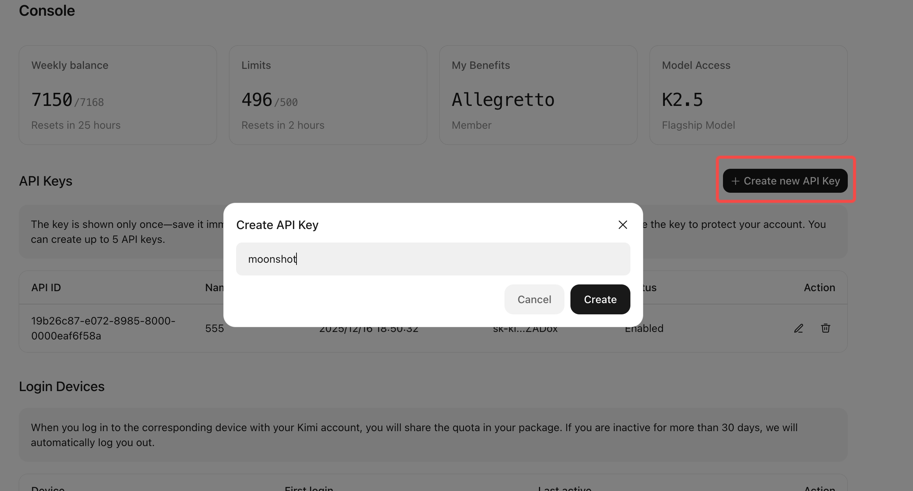
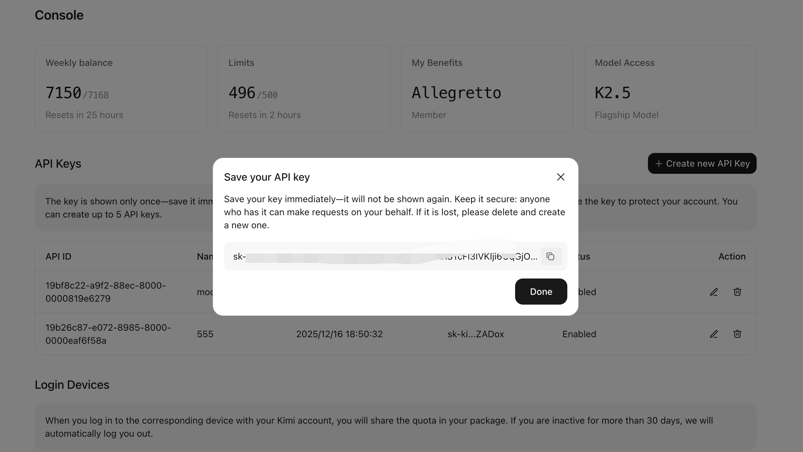
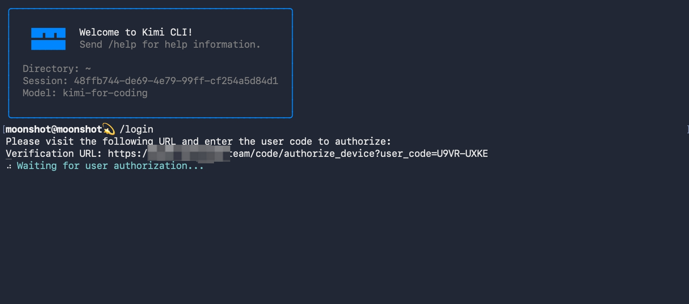
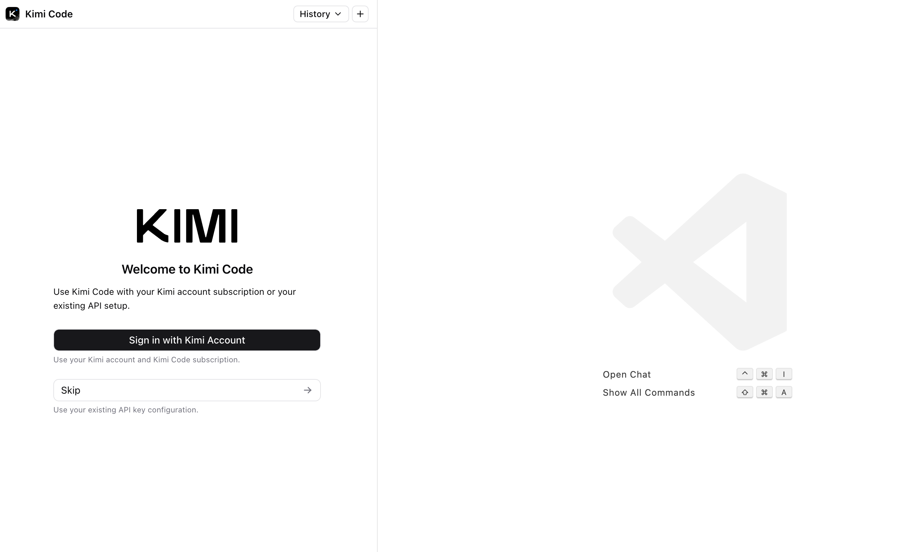
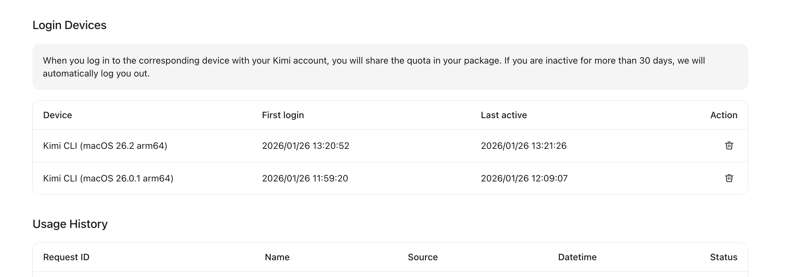

# Kimi Code 会员权益指南

Kimi Code 是 Kimi 会员计划中专为代码开发场景打造的**增值会员权益**，旨在为开发者提供更强大的模型性能与更深度的工具集成。

## 核心优势

* **广泛兼容：** 完美适配 **Kimi Code CLI**、**Claude Code**、**Roo Code**，轻松融入各类开发工作流。
* **极速响应：** 最高输出速度可达 **100 Tokens/s**，大幅提升编码效率。
* **高频并发：** 每 5 小时的 Tokens 总量可支持约 **300-1200** 次 API 请求，确保复杂项目不间断。

## 快速开始

> **新用户：** 请前往 [Kimi Code 官网](https://www.kimi.com/code) 登录并选择合适的 Coding Plan。
>
> **已订阅用户：** 可直接进入 [Kimi Code 控制台](https://www.kimi.com/code/console) 管理您的 API Key 或授权设备。

### 第一步：获取您的 Kimi Code API Key

如果您需要在第三方 Agent 或自定义环境中使用，请按以下步骤操作：

1.  **进入控制台：** 访问 `Kimi Code 控制台` -> `API keys`。
2.  **创建密钥：** 点击创建/查看对应 keys。
    
3.  **保存凭证：** 在弹窗中复制并妥善保存您的 API Key。
    

### 第二步：配置至您的开发工具

您可以根据使用场景选择对应的配置指南：

* 📖 [在 Kimi Code for CLI 中配置会员权益](./kimi-cli/guides/getting-started.html)
* 🤖 [在 Claude Code 或 Roo Code 中配置会员权益](./more/third-party-agents.html)

## 官方 Agent 一键登录

针对 Kimi 官方 Coding Agent，我们还提供了更便捷的**一键登录**功能，系统会自动完成设备授权与账号绑定。

#### 在 Kimi Code for CLI 中使用
只需执行 `/login` 命令即可完成授权：

#### 在 VS Code 环境中使用
您可以在 Kimi Code for VS Code 的终端中直接运行登录命令：

## 设备管理与安全

您可以在控制台中实时查看并管理已授权的设备列表：

> **关于登录有效期：**
> 为保障账户安全，若您的设备超过 **30 天** 未处于活跃状态，系统将自动使对应 Code Agent 的登录态失效并从控制台中移除记录。如需再次使用，只需重新执行 `/login` 流程即可。