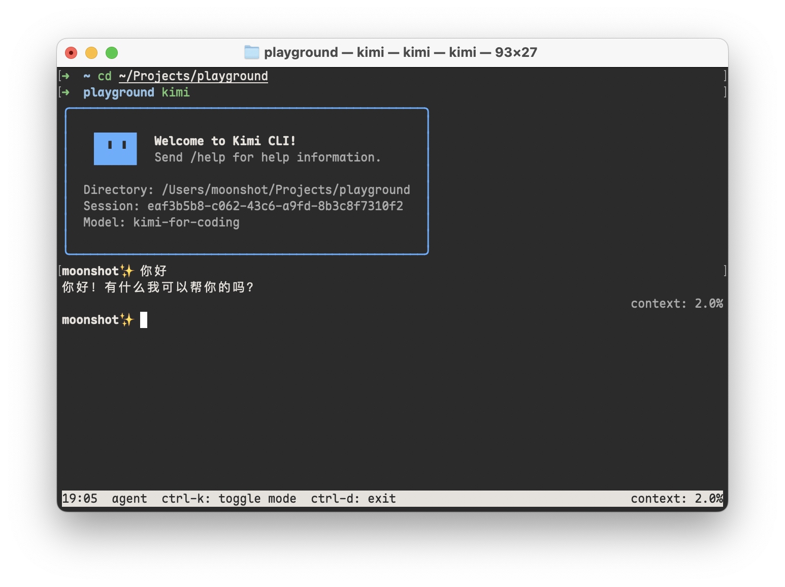
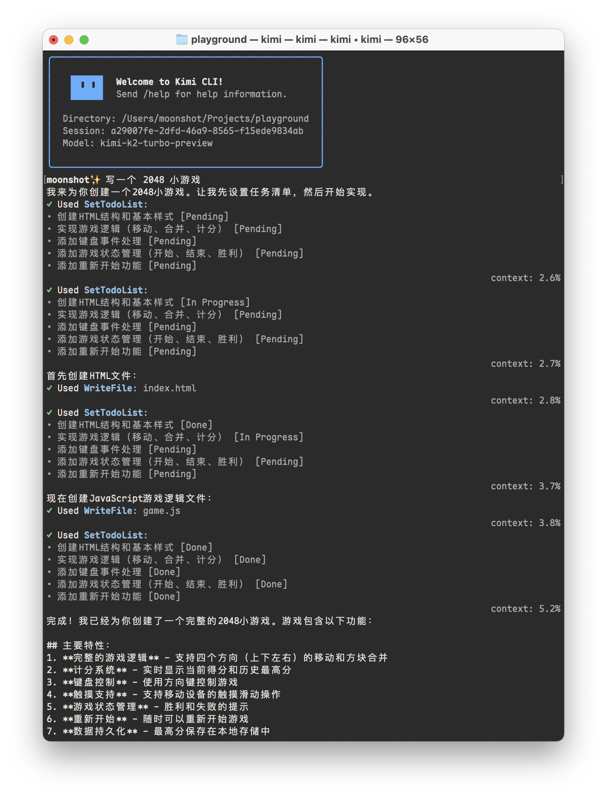
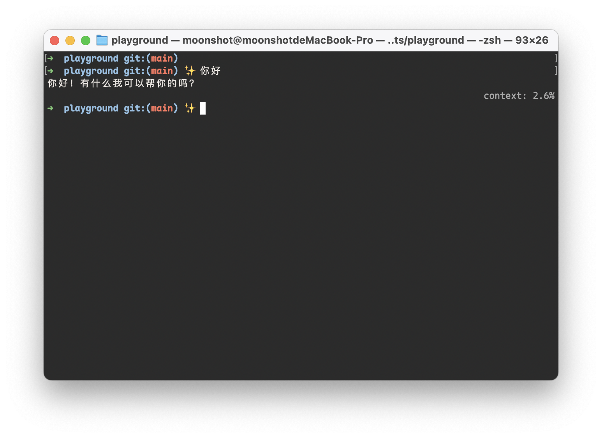

# Kimi CLI 使用说明

Kimi CLI 是 Moonshot AI 自研的命令行通用智能体工具，它可以帮助你快速完成各种各样的编程和文件处理等任务。

> Kimi CLI 目前还在 Technical Preview 阶段，如遇到 bug 或有任何意见或建议，欢迎通过 https://github.com/MoonshotAI/kimi-cli/issues 提交反馈！



## 安装

Kimi CLI 要求使用 uv 包管理器安装。

如果你的系统中还没有安装 uv，请先参考 [uv 安装说明](https://docs.astral.sh/uv/getting-started/installation/) 进行安装。通常，在 macOS 和 Linux 系统中，可使用以下命令安装 uv：

```sh
curl -LsSf https://astral.sh/uv/install.sh | sh
```

安装 uv 后，使用以下命令安装 Kimi CLI：

```sh
uv tool install --python 3.13 kimi-cli
```

运行以下命令检查是否安装成功：

```sh
kimi --version
```

> 由于 macOS 的安全校验机制，在 macOS 上第一次运行可能需要较长时间，请耐心等待。可以尝试将你所使用的终端工具添加到「系统设置」-「隐私与安全性」-「开发者工具」中，以信任终端上运行的程序。

## 升级

使用以下命令升级 Kimi CLI：

```sh
uv tool upgrade kimi-cli --no-cache
```

## 使用

在命令行中进入你想要 Kimi CLI 操作的项目目录，运行 `kimi` 命令，即可启动 Kimi CLI。例如：

```sh
cd my-project
kimi
```

首次运行时，Kimi CLI 会提示没有配置模型，需输入 `/setup` 元命令，进入配置流程：


Coding 会员权益用户，选择第一个「Kimi For Coding 」，在随后的提示中，输入在会员页面获得的 API Key，并选择 `kimi-for-coding` 模型；Moonshot AI 开放平台用户，根据提示选择对应的平台，输入 API Key 并选择想要使用的模型。

配置完成后，即可开始使用 Kimi CLI，例如：



如需查看更多用法，可输入 `/help`。

## Thinking 模式

在 Kimi CLI 中，你可以使用 tab 键切换 Thinking 模式。

## Shell 模式

Kimi CLI 不仅仅是一个编程智能体，还可以通过 Ctrl-X 快捷键切换到 shell 模式。通过该模式，你可以在不离开 Kimi CLI 的情况下，直接执行 shell 命令，方便进行文件操作和查看结果。例如：


> 内置 shell 命令（例如 `cd`）暂不支持。

## 搭配 Zsh 使用

Zsh 用户可以搭配 [zsh-kimi-cli](https://github.com/MoonshotAI/zsh-kimi-cli) 插件，在 shell 中快速调用 Kimi CLI。

使用如下命令安装（以 oh-my-zsh 为例，其它包管理请参考仓库 README）：

```sh
git clone https://github.com/MoonshotAI/zsh-kimi-cli.git \
  ${ZSH_CUSTOM:-~/.oh-my-zsh/custom}/plugins/kimi-cli
```

然后在 `~/.zshrc` 中启用该插件：

```sh
plugins=(... kimi-cli)
```

重新启动 Zsh 之后，即可在 Zsh 中通过 Ctrl-X 进入 Kimi CLI 模式：



目前 zsh-kimi-cli 插件还在持续更新中，请定期前往 `custom/plugins/kimi-cli` 目录通过 `git pull` 拉取更新。

## IDE 集成（ACP）

Kimi CLI 原生提供 [Agent Client Protocol](https://github.com/agentclientprotocol/agent-client-protocol) 支持，可以搭配任何 ACP 客户端使用，例如 [Zed 编辑器](https://zed.dev/) 或 [JetBrains](https://blog.jetbrains.com/ai/2025/12/bring-your-own-ai-agent-to-jetbrains-ides/)。

> ACP 是 Zed 编辑器推出的一种通用智能体协议，使智能体的核心功能（服务端）和用户界面（客户端）解耦，用户可以自由选择不同的智能体服务端和客户端进行搭配使用。

要在 ACP 客户端中使用 Kimi CLI，首先需在终端运行 Kimi CLI，并完成 `/setup` 配置流程。随后在 ACP 客户端中配置启动命令为 `kimi --acp`（如需开启 Thinking 模式则使用 `kimi --acp --thinking`）。

例如，要在 Zed 或 JetBrains 中使用 Kimi CLI，请在 `~/.config/zed/settings.json` 或 `~/.jetbrains/acp.json` 中添加以下内容：

```json
{
  "agent_servers": {
    "Kimi CLI": {
      "command": "kimi",
      "args": ["--acp", "--thinking"],
      "env": {}
    }
  }
}
```

随后即可在 IDE 的 Agent 面板创建 Kimi CLI Thread：


## 接入 MCP 工具

Kimi CLI 支持 MCP（Model Context Protocol）工具。

**`kimi mcp` 子命令组**

你可以使用 `kimi mcp` 管理 MCP 服务器，例如：

```sh
# 添加可流式 HTTP 服务器：
kimi mcp add --transport http context7 https://mcp.context7.com/mcp --header "CONTEXT7_API_KEY: ctx7sk-your-key"

# 添加需要 OAuth 授权的可流式 HTTP 服务器：
kimi mcp add --transport http --auth oauth linear https://mcp.linear.app/mcp

# 添加 stdio 服务器：
kimi mcp add --transport stdio chrome-devtools -- npx chrome-devtools-mcp@latest

# 查看已添加的 MCP 服务器：
kimi mcp list

# 移除 MCP 服务器：
kimi mcp remove chrome-devtools

# 授权 MCP 服务器：
kimi mcp auth linear
```

**临时 MCP 配置**

Kimi CLI 也支持通过 CLI 参数临时指定 MCP 服务器配置。

给定一个符合 MCP 通用配置格式的文件，例如：

```json
{
  "mcpServers": {
    "context7": {
      "url": "https://mcp.context7.com/mcp",
      "headers": {
        "CONTEXT7_API_KEY": "YOUR_API_KEY"
      }
    },
    "chrome-devtools": {
      "command": "npx",
      "args": ["-y", "chrome-devtools-mcp@latest"]
    }
  }
}
```

启动时，通过 `--mcp-config-file` 参数指定 MCP 配置文件路径即可。例如：

```sh
kimi --mcp-config-file /path/to/mcp.json
```

## 更多用法

除了上述功能，可以通过 `kimi --help` 查看更多用法。
