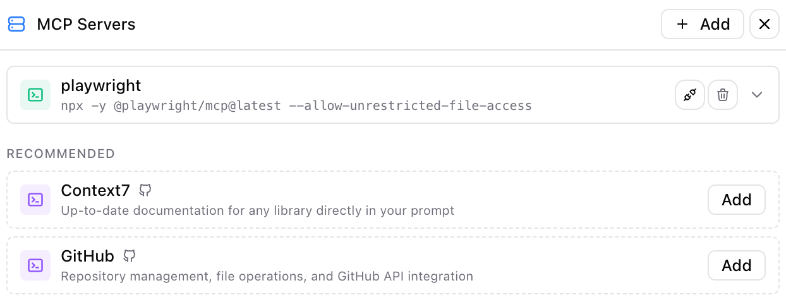

# Kimi Code for VS Code

Kimi Code for VS Code 是集成于 Visual Studio Code 的扩展插件。安装后，您可在编辑器内直接发起提问、审查代码 diff 并快速提交变更。插件能够读取您引用的文件内容，并通过可视化界面展示修改建议，经您确认后执行。整个流程由您掌控，同时显著提升开发效率。

本扩展在 VS Code 中提供了原生聊天面板，支持通过 `@` 符号引用文件或文件夹、`/` 命令执行项目扫描与上下文管理、diff 视图展示文件变更并支持回退操作，同时支持集成 MCP 服务器以调用外部工具。聊天面板可置于活动栏、侧边栏或独立标签页中。

## 环境要求

需拥有 Kimi 账号订阅或 Kimi API 密钥。

## 安装方式

通过 [VS Code Marketplace](vscode:extension/moonshot-ai.kimi-code) 安装。

若安装后未显示扩展，请重启 VS Code 或在命令面板中执行 "Developer: Reload Window" (Mac: Cmd+Shift+P, Windows/Linux: Ctrl+Shift+P)。

## 身份认证

Kimi Code 支持两种认证模式：

**Kimi 账号模式**：点击登录按钮，浏览器将打开授权页面，完成授权流程后返回 VS Code。

**API Key 模式**：若已配置 API Key，可点击跳过登录。插件将在此模式下运行。

您可随时通过齿轮图标切换认证模式。登出后将返回登录界面。

## 基本使用

### 打开面板

点击活动栏中的 Kimi 图标，或通过命令面板执行 "Kimi Code" 命令。

### 文件引用

输入 `@` 后选择文件或文件夹名称。例如：`@src/handlers/` 引用文件夹，`@app.ts` 引用文件，`@src/app.ts:10-20` 引用特定行范围。

按 `Alt+K` 可快速插入当前文件或选中代码作为引用。

### 斜杠命令

输入 `/` 打开命令菜单。使用 `/init` 扫描项目并生成文档，或使用 `/compact` 压缩过长的上下文。

### 输入历史

在输入框中按 `↑` / `↓` 键可快速浏览最近发送过的消息历史，方便重复或修改提问。

### 媒体文件输入

支持粘贴、拖拽或选择媒体文件。支持的格式包括：PNG、JPEG、GIF、WebP、HEIC 等图片格式，以及 MP4、WebM、MOV 等视频格式。

- **粘贴 / 拖拽**：单张图片原始大小不超过 5MB，系统会自动进行压缩（HEIC 转 JPEG、超尺寸缩放、质量压缩至约 2MB）。
- **文件选择器**：通过输入框的 "+" 按钮或 `@` 菜单选择文件时，图片不超过 10MB，视频不超过 20MB。
- **通用限制**：每条消息最多附加 9 个文件，总计不超过 80MB。当附加媒体文件时，不支持多模态的模型将被自动过滤。

## 模型与深度思考模式

通过输入栏下拉菜单切换模型。

部分模型支持扩展推理能力。思考模式切换有三种状态：模型不支持思考模式时隐藏、用户可手动启用/禁用、或像 k2-thinking 模型始终开启。

启用后，思考步骤在响应中默认折叠，可展开查看推理过程。在设置中开启 `kimi.alwaysExpandThinking` 可默认展开思考过程。

## 操作确认与工具执行

当 Kimi 提议运行工具或写入文件时，将显示确认对话框，提供三个选项：

- **Yes**：仅批准当前操作
- **Yes, for this session**：批准当前会话内同类操作，直至开启新会话
- **No**：拒绝执行操作

在设置中启用 `kimi.yoloMode` 可自动批准所有工具调用。适用于信任工作流程且追求效率的场景。

### 问答弹窗（Question Dialog）

在执行过程中，Kimi 可能会向你提出问题（例如让你选择实现方案）。此时底部会弹出问答卡片，你可以直接点选预设选项，或选择 "Custom response..." 输入自定义回复。回答后 Kimi 会继续执行。

## 文件变更追踪

Kimi 修改文件后，所有变更将被追踪并显示在"文件变更"栏中。您可以查看被修改文件的列表及其状态（新增、修改或删除），以及增删行数统计。

针对每个文件，您可在 VS Code 原生 diff 视图中查看变更、恢复至原始状态，或保留变更以清除追踪记录。支持批量操作，可一次性保留或撤销所有变更。基准状态在会话中首次修改时捕获，回退将恢复至此基准版本。

## 计划模式（Plan Mode）

点击输入框左侧的 📋 图标可进入计划模式。开启后，Kimi 在正式执行前会先输出一个可展开的计划卡片（Plan Card），列出它打算执行的步骤。你可以审阅计划后再让它继续。

- 计划模式按钮在每次新会话时保持上次的设置。
- 如果 Kimi 已经在流式回复中，退出计划模式需要二次确认，以免打断当前任务。

## 消息队列

当 Kimi 正在回复时，你可以在输入框中继续输入并发送。这些消息不会丢失，而是会进入**消息队列**。底部工具栏会显示队列数量，点击可展开队列面板：

- 查看待发送的消息列表
- 编辑或删除队列中的消息
- 调整消息顺序
- 在 Kimi 回复过程中，点击队列项的 ⚡ 图标可将该消息立即作为 **Steer** 插入，引导 Kimi 调整当前回复方向

## 历史会话

点击面板顶部的历史下拉菜单可浏览过往会话。会话数据本地存储，支持关键词搜索。您可删除旧会话或加载会话以继续之前的对话。

状态栏显示上下文使用百分比及输入输出 token 计数。当上下文使用率较高时，请使用 `/compact` 命令进行压缩。

## 工作目录切换

点击输入框右侧的齿轮图标（Action Menu）→ **Working Directory**，可以在当前 Workspace 的不同子目录间切换工作目录。切换后会自动开启新会话，以便 Kimi 基于新的目录上下文工作。支持直接选择已注册的子目录，或通过 "Browse..." 浏览任意子文件夹。

## MCP 服务器

MCP（Model Context Protocol）服务器可为 Kimi 扩展外部工具与服务。通过操作菜单 > MCP 服务器进行管理。

支持两种传输类型：stdio（本地命令行工具，需指定命令、参数和环境变量）和 http（远程服务，需指定 URL，可选 OAuth）。

提供推荐服务器的一键安装，包括 Playwright（浏览器自动化）、Context7（实时文档）和 GitHub（API 访问）。部分服务器需 OAuth 认证，点击授权按钮打开流程，或重置凭证。保存前可测试连接以验证服务器可用性。

## 操作菜单（Action Menu）

输入框右侧的齿轮图标是操作菜单入口，包含以下功能：

- **Working Directory**：切换当前工作目录（详见上文"工作目录切换"）
- **MCP Servers**：打开 MCP 服务器配置面板
- **General Config**：打开 VS Code 设置中的 Kimi 配置页
- **Show Logs**：打开 Kimi Code 输出日志面板，便于排查问题
- **Reset Kimi**：重置 Kimi Webview，适用于界面卡死或无响应的情况
- **Sign out / Sign in**：登出或重新登录 Kimi 账号

此外，你也可以在 VS Code 命令面板中执行 "Kimi Code: Run CLI"，在集成终端中直接启动 Kimi Code CLI。

## 命令与快捷键

| 快捷键                          | 功能                                  |
| ------------------------------ | ------------------------------------ |
| `Ctrl+Shift+K` / `Cmd+Shift+K` | 聚焦 Kimi 输入框                      |
| `Alt+K`                        | 插入当前文件引用                      |
| `Ctrl+N` / `Cmd+N`             | 新建对话（需启用 `kimi.enableNewConversationShortcut`，启用后将占用系统默认的"新建文件"快捷键）|
| `↑` / `↓`                      | 在输入框中浏览输入历史                |

在命令面板中输入 "Kimi Code" 可访问更多命令：在新标签页打开、在侧边栏打开、新建对话等。

## 设置配置

在 VS Code 设置的 "Kimi" 部分进行配置。

| 设置项                              | 默认值 | 说明                                  |
| ------------------------------------ | ------- | ------------------------------------ |
| `kimi.yoloMode`                      | false   | 自动批准所有工具调用                  |
| `kimi.autosave`                      | true    | Kimi 读写文件前自动保存               |
| `kimi.executablePath`                | ""      | 自定义 Kimi Code CLI 路径（空值使用内置）|
| `kimi.enableNewConversationShortcut` | false   | 启用 Cmd/Ctrl+N 新建对话快捷键        |
| `kimi.useCtrlEnterToSend`            | false   | 使用 Ctrl/Cmd+Enter 发送消息          |
| `kimi.environmentVariables`          | {}      | 传递给 Kimi Code CLI 的环境变量        |
| `kimi.alwaysExpandThinking`          | false   | 默认展开思考/推理过程                 |
| `kimi.editorContext`                 | never   | 控制何时共享当前编辑器的文件和光标位置（never / onConversationStart / onFileChange）|

## 故障排查

**未打开工作区**：请在 VS Code 中打开文件夹，Kimi Code 需要工作区才能正常工作。

**CLI 未找到**：请手动安装 Kimi Code CLI 并设置 `kimi.executablePath`，或确保内置 CLI 存在。

**登录持续失败**：请尝试跳过登录使用 API 密钥模式，检查网络连接，或稍后通过操作菜单重试。

**发送无响应**：请确认 Kimi Code CLI 可用、模型已配置且工作区文件夹已打开。通过 "Kimi Code: Show Logs" 查看错误日志。

**连接超时**：若 30 秒内无响应将超时。请检查网络后重试。

**预检错误**：某些错误会阻止发送，如 Kimi Code CLI 未找到、版本过低、未登录或会话忙碌。错误将以 toast 提示，您的输入将被保留以便重试。

## 典型工作流

**代码解读**：输入 `@` 选择文件或文件夹，请求解释代码流程，可继续追问细节。

**重构**：引用目标代码如 `@src/feature/`，请求重构方案，审查 diff 并选择性批准，必要时使用回退。

**调试**：粘贴错误信息或堆栈跟踪，引用相关文件，请求诊断与修复，然后批准提议的变更。

**项目概览**：引用文件夹如 `@src/services/`，请求模块地图或架构摘要，可继续询问依赖关系或薄弱环节。

## 快速参考

输入 `/` 打开命令菜单，`@` 引用文件或文件夹。按 `Alt+K` 插入当前文件。通过操作菜单（齿轮图标）访问设置、MCP 配置和认证。文件变更栏显示所有修改，支持 diff 和回退。切换思考模式进行深度推理，或启用 YOLO 模式自动批准操作。

---